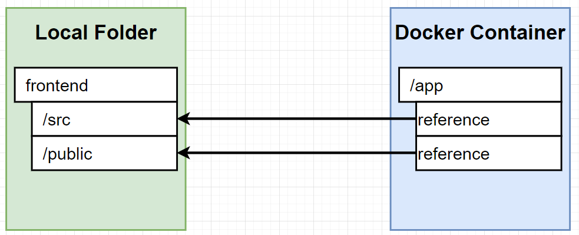

# Creating a Production-Grade Workflow with Docker

I want to develop an app with Docker and be able to push it to an outside hosting service, like AWS.

### Flow Architecture


- Download and install Node from official Node website.
- Once it's installed, run `node -v` to get the version.
- I created a new folder caller *workspace_proj*. Inside that folder, run `npx create-react-app frontend`

- I received multiple npm errors
- I installed the latest version of npm by running `npm install -g npm@9.8.1`

Running `npx create-react-app frontend` again gave the following output:


This created a directory called *frontend*. 

`cd` into the directory.


- Run `npm run test`
- Run `npm run build`
- After the build command, directories have been added to pwd
- These are the app's dependencies


- Running `npm run start` gives the below output and opens a new browser tab:


## Setting up the Dockerfile

There will be two separate Dockerfiles - one for app development and the other for production.

In `frontend/` create **Dockerfile.dev**.

```
FROM node:16-alpine

WORKDIR 'app/'

COPY package.json .

RUN npm install

COPY . .

CMD ["npm", "run", "start"]
```

The `docker build` command needs to be amended as there is no file called Dockerfile, only Dockerfile.dev.

I instead need to run:

```
docker build -f Dockerfile.dev
```
to specify the file I want to build.

It takes FOREVER to build because of the additional dependencies. Dependencies were automatically installed to our pwd, but I usually get my dependencies from the Docker image.

Since I essentially have two copies of dependencies, I should delete one. 

In `frontend/` I deleted the folder *node_modules*, and then rebuild.

Then,
```
docker run <image id>
``` 

I get this output:


But when I go to localhost:3000 the site cannot be reached.

I need to expose the port in the run command and map it.

I need to run:
```
docker run -p 3000:3000 <image id>
```

Now it works on port 3000.

## Docker Volumes

The source code for the React App homepage is located in frontend -> src -> App.js.

If I edit that file to add a picture of Kipo, it doesn't appear on the app.

This is because the dependencies have been copied from my local folder to the temporary Docker container.


There needs to be a way where I can update the source code and the app updates in realtime without having to rebuild the image or restarting the container.

The volume is going to set up a reference that's going to point back to my local machine to access the folders in my local machine.



I'm essentially setting up mapping from a folder in the temp container to a folder in my local computer.